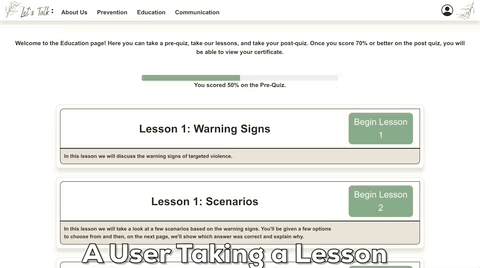

# Final Project - Let's Talk CMU
This project is the first project for MDX (Mesa Digital Experience), a club on campus. This website is designed to be a learning platform to teach Resident Assistants about targeted violence prevention. This goal is achieved via a competency based training course and a simple quiz. This website was developed for the Invent to Prevent competition put on by the Department of Homeland Security and in cooperation with the CMU Marketing department.

You can see the website hosted in action here: [lets-talk-cmu.com](https://lets-talk-cmu.com)

# Repo Structure
In the root directory you will see a back-end Folder. This folder contains the backend Express API that is responsible for handling Auth requests and content requests.

Also in the root directory you will see a front-end folder. This folder contains a single page react app that is served statically.

Lastly you will also find an "evidence" folder in the root directory. This folder contains gifs that show the application in action.
# Assignment Evidence
This section will show off the various features of the website in action.

### Sign Up

### Sign In

### Users Taking Quizzes

### Users Taking Lessons

### Users Accessing Certificate of Completion

# Credit
## William Jessop (CSCI 310 - Adv JS)
- JSX for Auth components (login/logout/sign up)
- JSX for Quizzes
- JSX for initial Home page
- Frontend Routing configuration
- Frontend Content loading logic
- Frontend Auth logic
- MongoDB setup and configuration
- Backend Auth logic
- Backend API Content endpoints
- AWS EC2 hosting configuration w/ nginx
- AWS Route53 DNS configuration
- Let's Encrypt SSL configuration
## Jacob Hansen (CSCI 206 - Web 2)
- JSX for Navbar
- JSX refactor for footer
- JSX for Communication page
- JSX for Prevention page
- JSX for LessonCard Component
- Frontend Content Dynamic rendering logic
- Work on reactive CSS styles in App.css

## Nathan Daniel (CSCI 206 - Web 2)
- Graphic design work (including but not limited to colors, layouts, and custom graphics)
- JSX for About Us page
- JSX refactor of Home Page
- JSX for footer component
- Work on reactive CSS styles in App.css
- React-bootstrap w/ SASS Theme configuration